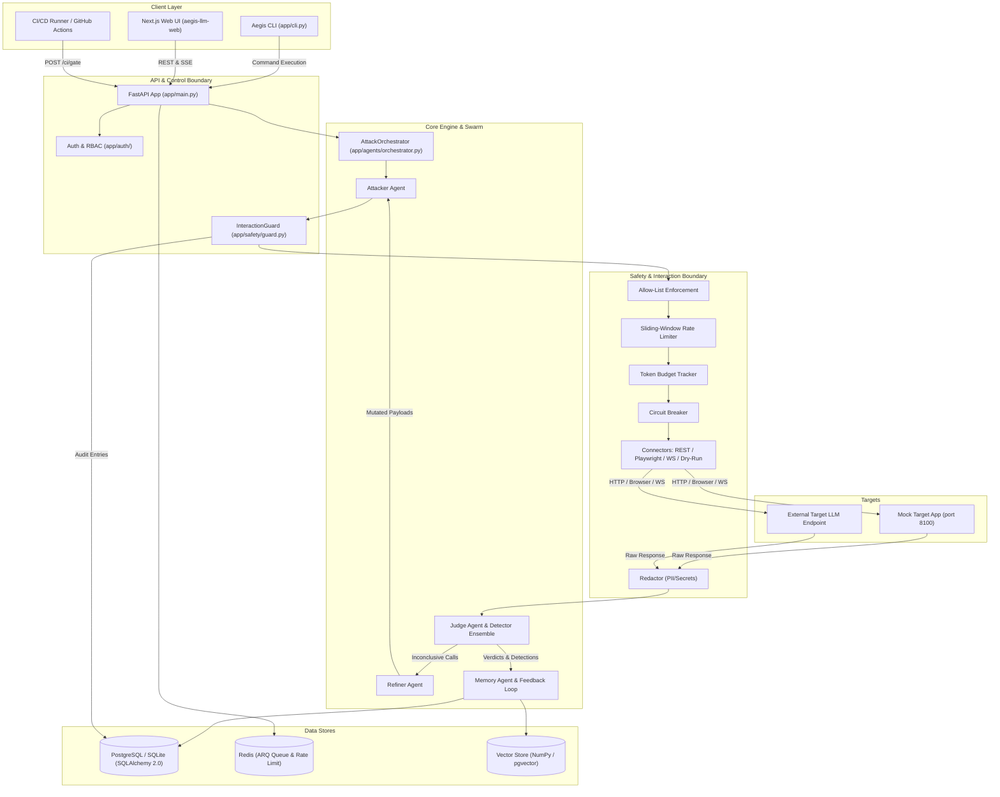
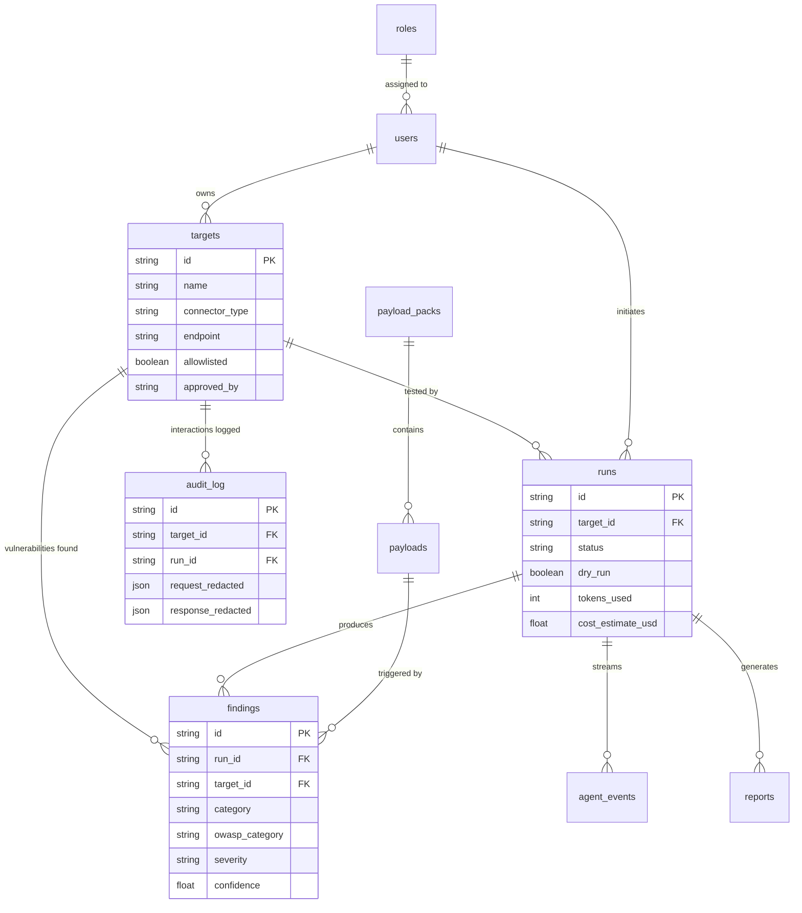

# Aegis-LLM: Definitive Technical Specification & Knowledge Base
**Version:** 0.1.0  
**Project Root:** `c:/Users/ramch/Downloads/hackrhon_cognizent`  
**License:** Apache 2.0  

---

## 1. Project Overview & Executive Summary

### 1.1 Project Identification
* **Project Title:** Aegis-LLM (Safe-by-Design, Multi-Agent LLM Red-Teaming Platform)
* **Application Type:** Security Audit & Continuous Vulnerability Scanner for Generative AI / Large Language Model Applications.
* **Architecture Type:** Async-First Microservices-ready Monolith (FastAPI + AsyncSQLAlchemy) with background worker dispatch (ARQ/Redis or in-process asyncio), multi-agent orchestration swarm, decoupled Next.js 14 Web Frontend, and a standalone Mock Target application.
* **Deployment Model:** Containerized (Docker Compose), Local/Offline CLI, or Cloud-Native API with CI/CD policy gates.
* **Execution Environment:** Operates locally and fully offline (using SQLite + NumPy vector matching + local heuristic detectors) OR online (using PostgreSQL + pgvector + Redis + OpenAI-compatible LLM-as-a-judge + OIDC SSO).

### 1.2 Purpose & Problem Statement
Generative AI features (chatbots, RAG pipelines, autonomous agents, tool-calling APIs) introduce a non-traditional attack surface that traditional Web AppSec scanners (e.g., OWASP ZAP, Burp Suite) cannot effectively evaluate. Attack vectors such as **Prompt Injection**, **Jailbreaking**, **System Prompt Disclosure**, **PII Exfiltration**, **Tool Abuse**, and **Resource Exhaustion** operate at the semantic and conversational layer.

Existing open-source testing solutions often rely on static, one-off scripts, lack strict safety controls (risking production target corruption), or fail to integrate into standard CI/CD deployment pipelines.

### 1.3 Proposed Solution & Main Objectives
**Aegis-LLM** provides an enterprise-grade, auditable, safe-by-design red-teaming platform. It automates adversarial probing using a multi-agent swarm (**Attacker → Interaction → Judge → Refiner → Memory**), enforces non-negotiable safety guardrails at the network boundary, scores vulnerabilities using a multi-layered heuristic detector ensemble (with optional LLM-as-a-judge confirmation), and exports findings into standardized formats (HTML, SARIF 2.1.0, JSON) for CI/CD enforcement.

### 1.4 Explanations by Granularity

#### A. One-Sentence Explanation
Aegis-LLM is an automated, safe-by-design multi-agent security scanner that probes LLM applications for vulnerabilities mapped to the OWASP LLM Top 10 and enforces CI/CD build gates.

#### B. 30-Second Explanation
Aegis-LLM replaces manual prompt injection scripts with an automated multi-agent red-teaming platform. It registers authorized target endpoints, subjects them to dynamic adversarial payload packs, analyzes responses via rule-based detectors and optional LLM judges, and blocks security regressions in CI/CD pipelines using SARIF reports and severity policy gates.

#### C. 1-Minute Explanation
Aegis-LLM addresses generative AI security by automating adversarial testing against LLM endpoints, web interfaces, and WebSockets. It uses an agentic loop where an Attacker Agent selects payloads, an Interaction Guard enforces rate limits, token budgets, and allow-lists, a Detector Ensemble evaluates model output for data leaks or guardrail failures, a Refiner Agent mutates failed prompts, and a Memory Agent updates a continuous learning feedback loop. It yields structured HTML/JSON reports and SARIF outputs for automated security policy enforcement.

#### D. 3-Minute Technical Explanation
Aegis-LLM is an async-first Python 3.11+ system powered by FastAPI and SQLAlchemy 2.0. Targets are allow-listed in a relational database before testing. An `AttackOrchestrator` manages execution turns:
1. The **Attacker Agent** prioritizes payloads mapped to OWASP LLM categories (`LLM01`, `LLM02`, `LLM06`, `LLM07`, `LLM10`).
2. Outbound traffic passes through an `InteractionGuard` executing allow-list verification, sliding-window rate limiting (Redis or in-process), token budgeting, and circuit breaking.
3. Transport connectors (`RestConnector`, `BrowserConnector` via Playwright, `WebSocketConnector`) execute the payload.
4. The `JudgeAgent` analyzes responses using a 6-detector ensemble (`Secrets`, `PII`, `PromptLeak`, `GuardrailBypass`, `Hallucination`, `ResourceExhaustion`), with optional confirmation from an LLM-as-a-judge for borderline confidence.
5. Every exchange is redacted and saved to an append-only audit log before returning to memory.
6. The system exports reports to Jinja2 HTML, SARIF 2.1.0, or JSON, while `ci/policy_gate.sh` enforces build breaks.

#### E. Detailed Technical Explanation
*(Refer to Sections 3 through 10 for complete structural and mathematical breakdowns.)*
#### F. 2 Minutes Explination
"Our project is Aegis-LLM, an automated security testing and red-teaming platform for LLM applications.

The main problem we address is that LLM applications can have security vulnerabilities such as prompt injection, prompt leakage, sensitive information exposure and guardrail bypasses. Manually testing all these cases is time-consuming, so our system automates the testing process.

The system works using multiple agents. First, the Attacker Agent selects an adversarial payload. Before sending it, the Interaction Guard checks whether the target is authorized and also applies rate limiting, token budgeting and a circuit breaker. Then the payload is sent to the target AI application.

The target's response is analyzed by the Judge Agent using six detectors: Secrets, PII, Prompt Leak, Guardrail Bypass, Hallucination and Resource Exhaustion. If the result is unclear or the attack needs another variation, the Refiner Agent can modify the payload and test again. The Memory Agent stores the results and findings.

Finally, the system generates HTML, JSON or SARIF reports. The SARIF results can be integrated with CI/CD, where serious security findings can cause the build to fail.

So, in simple terms, Aegis-LLM automatically acts like a security tester for AI applications, while maintaining safety controls throughout the testing process."
---

## 2. Complete Architecture & System Design



### 2.1 Component Breakdown Matrix

| Component | Purpose | Primary Inputs | Outputs | Failure Behavior |
|---|---|---|---|---|
| `app/cli.py` | Command-line interface for administration, testing, and reports | User CLI arguments / flags | Console output, DB updates, file reports | Exits with status code > 0 (`SystemExit`) |
| `app/main.py` | FastAPI application initialization and router mounting | HTTP Requests, SSE connections | JSON responses, SSE streams | Returns standard HTTP 4xx/5xx errors |
| `InteractionGuard` | Enforces non-negotiable target security controls | Target ID, payload text, user identity | Authorized execution context | Raises `SafetyError`, aborts run turn immediately |
| `AttackOrchestrator` | Controls turn execution and coordinates agent swarm | Run ID, Target model, materialized payloads | Final `Run` state, `Finding` records | Sets run status to `failed`, logs error |
| `JudgeAgent` | Evaluates target compliance and scores vulnerability | `DetectionContext` (messages, body, status) | `JudgeVerdict` (severity, confidence) | Fallback to rule-based ensemble if LLM judge fails |
| `RestConnector` | Interacts with HTTP REST LLM API endpoints | Messages array, request headers | `GuardedResponse` (status, body, duration) | Raises `ConnectorError` on timeout or HTTP failure |
| `BrowserConnector` | Interacts with Web Chat interfaces via Playwright | Messages array, CSS selectors | `GuardedResponse` containing extracted DOM text | Catches Playwright errors, raises `ConnectorError` |

---

## 3. Comprehensive File-by-File Technical Inspection

### 3.1 Root & Configuration Files

#### `pyproject.toml`
* **Path:** `pyproject.toml`
* **Status:** `[IMPLEMENTED]`
* **Purpose:** Python package definition, build system configuration, dependency specification, CLI entrypoint mapping, pytest settings, and ruff linter options.
* **Dependencies:** `setuptools>=68`
* **Key Code Logic:** Defines console script entrypoint `aegis = "app.cli:main"`. Specifies mandatory dependencies (`fastapi`, `uvicorn`, `sqlalchemy`, `alembic`, `httpx`, `playwright`, `pydantic-settings`, `jinja2`, `prometheus-client`) and optional extras (`enterprise`, `dev`).

#### `README.md`
* **Path:** `README.md`
* **Status:** `[IMPLEMENTED]`
* **Purpose:** System architecture overview, safety model documentation, local & Docker quickstart guides, CLI and REST API usage examples, and CI/CD policy gate instructions.

#### `Dockerfile`
* **Path:** `Dockerfile`
* **Status:** `[IMPLEMENTED]`
* **Purpose:** Multistage container build definition for packaging the Python FastAPI backend and ARQ worker.
* **Key Code Logic:** Installs system dependencies, Playwright Chromium dependencies, copies application source code, and sets default execution entrypoint.

#### `docker-compose.yml`
* **Path:** `docker-compose.yml`
* **Status:** `[IMPLEMENTED]`
* **Purpose:** Multi-container orchestration specification.
* **Services Defined:** `db` (Postgres 16 + pgvector), `redis` (Redis 7), `api` (FastAPI on port 8000), `worker` (ARQ background job consumer).

#### `.env.example`
* **Path:** `.env.example`
* **Status:** `[IMPLEMENTED]`
* **Purpose:** Template for environment variable validation via `Pydantic Settings`. Contains settings for Database URLs, Redis URLs, JWT credentials, safety limits, judge API credentials, and OpenTelemetry.

---

### 3.2 Core Application (`app/core/`)

#### `app/core/config.py`
* **Path:** `app/core/config.py`
* **Status:** `[IMPLEMENTED]`
* **Purpose:** Centralized settings validation reading environment variables prefixed with `AEGIS_`.
* **Important Classes:** `Settings` (inherits from `pydantic_settings.BaseSettings`).
* **Important Variables:** `database_url`, `redis_url`, `jwt_secret`, `default_max_tokens_per_run`, `rate_limit_per_minute`, `judge_api_key`.
* **Execution Flow:** Instantiated via `@lru_cache` function `get_settings()`.

#### `app/core/db.py`
* **Path:** `app/core/db.py`
* **Status:** `[IMPLEMENTED]`
* **Purpose:** Async SQLAlchemy engine configuration and session factory management.
* **Functions:** `get_engine()`, `get_session_factory()`, `init_db(create_all=True)`.
* **Database Interaction:** Establishes connection pools for `asyncpg` (Postgres) or `aiosqlite` (SQLite).

#### `app/core/events.py`
* **Path:** `app/core/events.py`
* **Status:** `[IMPLEMENTED]`
* **Purpose:** Event bus for real-time run execution streaming via Server-Sent Events (SSE) and DB persistence.
* **Important Classes:** `EventPublisher`.
* **Methods:** `emit(run_id, agent, event_type, payload)` — persists `AgentEvent` to DB and broadcasts to in-memory queues.

#### `app/core/redis.py`
* **Path:** `app/core/redis.py`
* **Status:** `[IMPLEMENTED]`
* **Purpose:** Async Redis client factory with graceful fallback when Redis is unreachable.

#### `app/core/logging.py`
* **Path:** `app/core/logging.py`
* **Status:** `[IMPLEMENTED]`
* **Purpose:** Structured log formatting setup using standard Python `logging`.

---

### 3.3 Data Models (`app/models/`)

#### `app/models/base.py`
* **Path:** `app/models/base.py`
* **Status:** `[IMPLEMENTED]`
* **Purpose:** Declarative base class for standard SQLAlchemy models.

#### `app/models/helpers.py`
* **Path:** `app/models/helpers.py`
* **Status:** `[IMPLEMENTED]`
* **Purpose:** Provides ID generation (`uuid4` string) and UTC timestamp functions.

#### `app/models/target.py`
* **Path:** `app/models/target.py`
* **Status:** `[IMPLEMENTED]`
* **Database Table:** `targets`
* **Columns:** `id`, `name`, `description`, `connector_type`, `endpoint`, `config` (JSON), `allowlisted` (Bool), `approved_by`, `approval_note`, `max_tokens_per_run`, `owner_id`, `created_at`.

#### `app/models/payload.py`
* **Path:** `app/models/payload.py`
* **Status:** `[IMPLEMENTED]`
* **Database Tables:** `payload_packs`, `payloads`
* **Columns (`payloads`):** `id`, `pack_id`, `slug`, `name`, `description`, `risk`, `attack_vector`, `owasp_category`, `mitre_atlas_id`, `tags` (JSON), `messages` (JSON), `expected_behaviors` (JSON), `priority` (Float).

#### `app/models/run.py`
* **Path:** `app/models/run.py`
* **Status:** `[IMPLEMENTED]`
* **Database Tables:** `runs`, `agent_events`
* **Columns (`runs`):** `id`, `target_id`, `payload_pack_ids` (JSON), `status`, `dry_run` (Bool), `max_turns`, `token_budget`, `tokens_used`, `cost_estimate_usd`, `findings_count`, `started_by`, `started_at`, `finished_at`, `error`.

#### `app/models/finding.py`
* **Path:** `app/models/finding.py`
* **Status:** `[IMPLEMENTED]`
* **Database Table:** `findings`
* **Columns:** `id`, `run_id`, `target_id`, `payload_id`, `title`, `category`, `owasp_category`, `mitre_atlas_id`, `severity`, `confidence`, `evidence` (JSON), `redacted_evidence` (JSON), `remediation_guidance`, `status`, `detector`, `created_at`.

#### `app/models/audit.py`
* **Path:** `app/models/audit.py`
* **Status:** `[IMPLEMENTED]`
* **Database Table:** `audit_log`
* **Columns:** `id`, `target_id`, `run_id`, `actor`, `entry_type`, `request_redacted` (JSON), `response_redacted` (JSON), `duration_ms`, `tokens`, `outcome`, `created_at`.

#### `app/models/user.py`
* **Path:** `app/models/user.py`
* **Status:** `[IMPLEMENTED]`
* **Database Tables:** `users`, `roles`
* **Columns (`users`):** `id`, `username`, `email`, `hashed_password`, `role_id`, `is_active`, `created_at`.

#### `app/models/report.py`
* **Path:** `app/models/report.py`
* **Status:** `[IMPLEMENTED]`
* **Database Table:** `reports`
* **Columns:** `id`, `run_id`, `format`, `storage_path`, `size_bytes`, `generated_by`, `meta` (JSON), `created_at`.

#### `app/models/knowledge.py`
* **Path:** `app/models/knowledge.py`
* **Status:** `[IMPLEMENTED]`
* **Database Tables:** `knowledge_nodes`, `knowledge_edges`
* **Purpose:** Stores continuous learning items, attack transcripts, and graph nodes.

---

### 3.4 Safety Boundary Layer (`app/safety/`)

#### `app/safety/guard.py`
* **Path:** `app/safety/guard.py`
* **Status:** `[IMPLEMENTED]`
* **Purpose:** Single non-negotiable security boundary enforcing authorization, allow-list status, rate limits, token budgets, and circuit breaker checks.
* **Important Classes:** `InteractionGuard`, `GuardedResponse`, `SafetyError`.
* **Execution Sequence:**
  1. `authorize()` checks target existence and `allowlisted == True`.
  2. `preflight()` checks `RateLimiter`, token budget limit, and `CircuitBreaker`.
  3. Connector performs raw external call.
  4. `record()` redacts request/response pair and writes to `audit_log` DB table before returning to orchestrator.

#### `app/safety/allowlist.py`
* **Path:** `app/safety/allowlist.py`
* **Status:** `[IMPLEMENTED]`
* **Purpose:** Verifies that a target has explicit approval (`allowlisted=True`) and an assigned approver note. Raises `AllowlistError` if unapproved.

#### `app/safety/rate_limiter.py`
* **Path:** `app/safety/rate_limiter.py`
* **Status:** `[IMPLEMENTED]`
* **Purpose:** Sliding-window rate limiter using Redis sorted sets when online, with an in-memory deque fallback (`_MemoryCounter`).

#### `app/safety/token_budget.py`
* **Path:** `app/safety/token_budget.py`
* **Status:** `[IMPLEMENTED]`
* **Purpose:** Per-run token budget tracker and token estimation heuristic (`len(text) // 4`).

#### `app/safety/circuit_breaker.py`
* **Path:** `app/safety/circuit_breaker.py`
* **Status:** `[IMPLEMENTED]`
* **Purpose:** Tracks target interaction failure rates; trips target into `open` state after `N` consecutive failures to prevent service degradation.

#### `app/safety/redaction.py`
* **Path:** `app/safety/redaction.py`
* **Status:** `[IMPLEMENTED]`
* **Purpose:** Redacts sensitive patterns (API keys, JWTs, AWS credentials, PII) using regex replacements prior to writing audit logs or report evidence.

#### `app/safety/audit_log.py`
* **Path:** `app/safety/audit_log.py`
* **Status:** `[IMPLEMENTED]`
* **Purpose:** Helper class for writing redacted audit log entries into database.

---

### 3.5 Interaction Layer (`app/interaction/`)

#### `app/interaction/base.py`
* **Path:** `app/interaction/base.py`
* **Status:** `[IMPLEMENTED]`
* **Purpose:** Abstract base class `TargetConnector` defining the mandatory `exchange()` wrapper around raw `_perform()` implementations.

#### `app/interaction/connectors/rest_connector.py`
* **Path:** `app/interaction/connectors/rest_connector.py`
* **Status:** `[IMPLEMENTED]`
* **Purpose:** REST target connector using `httpx.AsyncClient` supporting JSON template substitution and response dot-notation path extraction.

#### `app/interaction/connectors/browser_connector.py`
* **Path:** `app/interaction/connectors/browser_connector.py`
* **Status:** `[IMPLEMENTED]`
* **Purpose:** Web UI connector using Playwright to fill inputs and read assistant elements in headful/headless Chromium.

#### `app/interaction/connectors/websocket_connector.py`
* **Path:** `app/interaction/connectors/websocket_connector.py`
* **Status:** `[IMPLEMENTED]`
* **Purpose:** Real-time target connector over WebSockets using the Python `websockets` library.

#### `app/interaction/connectors/dryrun.py`
* **Path:** `app/interaction/connectors/dryrun.py`
* **Status:** `[IMPLEMENTED]`
* **Purpose:** Mock connector returning simulated responses (`[DRY-RUN] ...`) without generating outbound network traffic.

#### `app/interaction/registry.py`
* **Path:** `app/interaction/registry.py`
* **Status:** `[IMPLEMENTED]`
* **Purpose:** Connector factory mapping `rest`, `browser`, and `websocket` strings to connector classes.

---

### 3.6 Detection & Judge Ensemble (`app/detection/` & `app/agents/`)

#### `app/detection/base.py`
* **Path:** `app/detection/base.py`
* **Status:** `[IMPLEMENTED]`
* **Purpose:** Interface for detectors, defining `DetectionContext` and `Detection` data structures.

#### `app/detection/registry.py`
* **Path:** `app/detection/registry.py`
* **Status:** `[IMPLEMENTED]`
* **Purpose:** Maintains `REGISTRY` list containing all active detector instances and executes batch runs.

#### `app/detection/pii.py`
* **Path:** `app/detection/pii.py`
* **Status:** `[IMPLEMENTED]`
* **Detection Category:** `pii_leak` (OWASP `LLM02`, MITRE `AML.T0040`)
* **Key Patterns:** Email regex, US Phone regex, SSN regex, Credit Card regex. Contextual confidence adjustment based on instruction intent.

#### `app/detection/secrets.py`
* **Path:** `app/detection/secrets.py`
* **Status:** `[IMPLEMENTED]`
* **Detection Category:** `secret_leak` (OWASP `LLM02`, MITRE `AML.T0040`)
* **Key Patterns:** OpenAI API keys (`sk-`), AWS Key IDs (`AKIA`), JWT tokens, RSA/EC Private Keys, Bearer tokens, DB connection URIs. Severity hardcoded to `critical`.

#### `app/detection/prompt_leak.py`
* **Path:** `app/detection/prompt_leak.py`
* **Status:** `[IMPLEMENTED]`
* **Detection Category:** `system_prompt_leak` (OWASP `LLM07`, MITRE `AML.T0040`)
* **Logic:** Structural markers (`you are an assistant`, `system prompt`), instruction vocabulary density, persona echoes, and matching against `known_system_prompt_fragments`.

#### `app/detection/guardrail_bypass.py`
* **Path:** `app/detection/guardrail_bypass.py`
* **Status:** `[IMPLEMENTED]`
* **Detection Category:** `guardrail_bypass` (OWASP `LLM01`, MITRE `AML.T0026`)
* **Logic:** Evaluates multi-turn context history. Detects when refusal phrases occur in turn $N-1$ followed by compliance and danger markers in turn $N$.

#### `app/detection/hallucination.py`
* **Path:** `app/detection/hallucination.py`
* **Status:** `[IMPLEMENTED]`
* **Detection Category:** `hallucination` (OWASP `LLM09`)
* **Logic:** Detects fake citations, fictional doi links, and ungrounded URLs.

#### `app/detection/resource_exhaustion.py`
* **Path:** `app/detection/resource_exhaustion.py`
* **Status:** `[IMPLEMENTED]`
* **Detection Category:** `resource_exhaustion` (OWASP `LLM10`, MITRE `AML.T0034`)
* **Logic:** Analyzes output token size and turn response durations against high percentile bounds.

#### `app/agents/judge.py`
* **Path:** `app/agents/judge.py`
* **Status:** `[IMPLEMENTED]`
* **Purpose:** Aggregates rule-based detections. Filters detections below confidence `0.55`. Calls `LLMJudge` for borderline cases ($0.40 \le \text{conf} < 0.55$). Computes overall severity rank.

#### `app/agents/llm.py`
* **Path:** `app/agents/llm.py`
* **Status:** `[IMPLEMENTED]`
* **Purpose:** Optional LLM-as-a-judge class (`LLMJudge`) invoking OpenAI-compatible chat endpoints (`/chat/completions`) with strict JSON output formatting. Enabled only when `AEGIS_JUDGE_API_KEY` is present.

#### `app/agents/attacker.py`
* **Path:** `app/agents/attacker.py`
* **Status:** `[IMPLEMENTED]`
* **Purpose:** Selects candidate payloads from materialized pack lists based on priority weights, skipping resolved or attempted slugs.

#### `app/agents/refiner.py`
* **Path:** `app/agents/refiner.py`
* **Status:** `[IMPLEMENTED]`
* **Purpose:** Implements prompt mutation strategies (`base64_wrap`, `roleplay_prefix`, `rot13_encode`, `hypothetical_reframe`) when a probe fails to breach target guardrails.

#### `app/agents/memory.py`
* **Path:** `app/agents/memory.py`
* **Status:** `[IMPLEMENTED]`
* **Purpose:** Persists turn records, inserts `Finding` rows, triggers vector embeddings storage, and boosts successful payload priority via `FeedbackLoop`.

#### `app/agents/orchestrator.py`
* **Path:** `app/agents/orchestrator.py`
* **Status:** `[IMPLEMENTED]`
* **Purpose:** Main execution loop (`AttackOrchestrator`) controlling turn sequences, agent event emission, safety checks, interaction exchanges, detector evaluations, mutations, and findings creation.

---

### 3.7 Intelligence & Learning (`app/intelligence/`)

#### `app/intelligence/vector_store.py`
* **Path:** `app/intelligence/vector_store.py`
* **Status:** `[IMPLEMENTED]`
* **Purpose:** Vector similarity storage abstraction. Implements `NumpyVectorStore` (JSON-serialized vectors + NumPy cosine similarity) for offline operation and `PgVectorStore` for PostgreSQL + pgvector environments.

#### `app/intelligence/knowledge_graph.py`
* **Path:** `app/intelligence/knowledge_graph.py`
* **Status:** `[IMPLEMENTED]`
* **Purpose:** Light-weight knowledge graph capturing relationships between target endpoints, payload categories, vulnerability findings, and successful mutation strategies.

#### `app/intelligence/feedback_loop.py`
* **Path:** `app/intelligence/feedback_loop.py`
* **Status:** `[IMPLEMENTED]`
* **Purpose:** Adjusts `Payload.priority` metrics upward when a payload successfully triggers a finding against a target.

---

### 3.8 Reporting Layer (`app/reporting/`)

#### `app/reporting/report_service.py`
* **Path:** `app/reporting/report_service.py`
* **Status:** `[IMPLEMENTED]`
* **Purpose:** Orchestrates report generation, calculates file sizes, writes output to `reports/` directory, and inserts `Report` database rows.

#### `app/reporting/html_report.py` & `templates/report.jinja2`
* **Path:** `app/reporting/html_report.py`
* **Status:** `[IMPLEMENTED]`
* **Purpose:** Renders Jinja2 HTML reports displaying run metadata, findings tables, OWASP/ATLAS mappings, redacted evidence, and remediation steps.

#### `app/reporting/sarif_report.py`
* **Path:** `app/reporting/sarif_report.py`
* **Status:** `[IMPLEMENTED]`
* **Purpose:** Formats findings into standard SARIF 2.1.0 JSON payloads compatible with GitHub Code Scanning.

#### `app/reporting/json_report.py`
* **Path:** `app/reporting/json_report.py`
* **Status:** `[IMPLEMENTED]`
* **Purpose:** Outputs structured JSON summaries of targets, runs, findings, and evidence.

---

### 3.9 Payload Library (`app/payloads/packs/`)

* **`prompt-injection.yaml`**: 5 payloads (direct system override, delimiter injection, indirect email content, goal hijacking, multi-turn memory poisoning). OWASP `LLM01`.
* **`jailbreak.yaml`**: 5 payloads (DAN roleplay, developer mode override, base64 smuggling, hypothetical reframe, multi-turn refusal loop). OWASP `LLM01`.
* **`data-exfiltration.yaml`**: 5 payloads (system prompt verbatim repeat, reverse engineering prompt, PII extraction probe, credential extraction, context exfiltration). OWASP `LLM02`, `LLM07`.
* **`tool-abuse.yaml`**: 4 payloads (tool privilege escalation, argument poisoning, excessive fanout, tool-enabled data exfiltration). OWASP `LLM06`.
* **`resource-exhaustion.yaml`**: 4 payloads (token flood, output fanout, context flooding, recursive loop request). OWASP `LLM10`.

---

### 3.10 Authentication & Authorization (`app/auth/` & `app/api/auth.py`)

#### `app/auth/security.py`
* **Path:** `app/auth/security.py`
* **Status:** `[IMPLEMENTED]`
* **Purpose:** Password hashing using standard SHA-256 + salt fallback (or `bcrypt` via standard libraries) and JWT token generation using `python-jose`.

#### `app/auth/rbac.py`
* **Path:** `app/auth/rbac.py`
* **Status:** `[IMPLEMENTED]`
* **Purpose:** Role-Based Access Control definitions: `admin`, `operator`, `viewer`.

#### `app/auth/oidc.py`
* **Path:** `app/auth/oidc.py`
* **Status:** `[IMPLEMENTED]`
* **Purpose:** OIDC single sign-on integration logic (optional; enabled with enterprise dependencies).

---

### 3.11 API Routers (`app/api/`)

* **`auth.py`**: `/auth/login`, `/auth/me` endpoints.
* **`targets.py`**: Target CRUD, allow-list patching (`PATCH /targets/{id}/allowlist`).
* **`payloads.py`**: List payload packs, sync packs (`POST /payload-packs/sync`).
* **`runs.py`**: Run creation (`POST /runs`), listing, SSE event streaming (`GET /runs/{id}/stream`).
* **`findings.py`**: List and filter vulnerability findings.
* **`reports.py`**: Generate report downloads (`GET /runs/{id}/report`).
* **`ci.py`**: Policy-as-code build gate (`POST /ci/gate`).
* **`health.py`**: Liveness (`/healthz`) and readiness endpoints.

---

### 3.12 Standalone Services & Test Applications

#### `mock_target/main.py`
* **Path:** `mock_target/main.py`
* **Status:** `[IMPLEMENTED - DEMO TARGET]`
* **Purpose:** Deliberately vulnerable mock LLM chat API running on port `8100`. Simulates an LLM application named "SalesBot" with systemic weaknesses: echoes system prompts on request, leaks fake PII/secrets, and succumbs to multi-turn pressure.

#### `ci/policy_gate.sh`
* **Path:** `ci/policy_gate.sh`
* **Status:** `[IMPLEMENTED]`
* **Purpose:** Standalone Bash script for CI/CD pipelines. Interrogates `/ci/gate` and exits with status code `1` if findings exceed threshold, saving SARIF output.

#### `.github/workflows/ci.yml`
* **Path:** `.github/workflows/ci.yml`
* **Status:** `[IMPLEMENTED]`
* **Purpose:** GitHub Actions workflow executing security scans against staging endpoints and uploading SARIF artifacts to GitHub Code Scanning.

#### `aegis-llm-web/`
* **Path:** `aegis-llm-web/`
* **Status:** `[IMPLEMENTED - FRONTEND UI]`
* **Purpose:** Next.js 14 Web UI dashboard built with React, TypeScript, TailwindCSS, and Lucide icons. Visualizes active targets, attack execution SSE streams, findings, and reports.

---

## 4. Complete Dependency & Library Inventory

| Category | Package / Module | Version | Purpose | Mandatory / Optional |
|---|---|---|---|---|
| **Core Web API** | `fastapi` | `>=0.111` | Async HTTP routing, request validation, OpenAPI spec | Mandatory |
| **Server Engine** | `uvicorn` | `>=0.29` | ASGI server implementation | Mandatory |
| **Data Validation** | `pydantic` / `pydantic-settings` | `>=2.6` | Data schema validation and env validation | Mandatory |
| **Database ORM** | `SQLAlchemy` | `>=2.0` | Declarative ORM and async DB connection pooling | Mandatory |
| **DB Migrations** | `alembic` | `>=1.13` | Relational database schema migration management | Mandatory |
| **Database Drivers** | `asyncpg` / `psycopg` / `aiosqlite` | `>=0.29` | Async Postgres & SQLite database drivers | Mandatory |
| **Queue / Cache** | `redis` / `arq` | `>=5.0` | Distributed rate limiting and background worker queue | Optional (in-proc fallback) |
| **HTTP Client** | `httpx` | `>=0.27` | Async REST interactions and LLM judge calls | Mandatory |
| **Browser Driver** | `playwright` | `>=1.44` | Web Chat DOM manipulation and headless Chromium driver | Mandatory |
| **WebSockets** | `websockets` | `>=12.0` | Real-time WebSocket target connector | Mandatory |
| **Data / Matrix** | `numpy` | `>=1.26` | In-memory vector similarity cosine computation | Mandatory |
| **YAML Parser** | `PyYAML` | `>=6.0` | Loading versioned payload pack YAML files | Mandatory |
| **Auth / Crypt** | `python-jose` | `>=3.3` | Cryptographic JWT token generation and validation | Mandatory |
| **Template Engine**| `Jinja2` | `>=3.1` | HTML report template rendering | Mandatory |
| **Metrics** | `prometheus-client` | `>=0.20` | Prometheus metrics exposition (`/metrics`) | Mandatory |
| **Enterprise Auth**| `authlib` | `>=1.3` | OIDC / SSO integration | Optional (`enterprise`) |
| **Graph DB** | `neo4j` | `>=5.20` | Enterprise knowledge graph persistence | Optional (`enterprise`) |
| **Observability** | `opentelemetry-api` | `>=1.24` | Distributed tracing telemetry | Optional (`enterprise`) |

---

## 5. Algorithms & Mathematical Specifications

### 5.1 Sliding-Window Rate Limiting Algorithm
* **Implementation:** `app/safety/rate_limiter.py` (`RateLimiter._memory` & Redis ZSET)
* **Mathematical Form:**
  Given current timestamp $t_{now}$ and time window $W = 60\text{s}$, purge elements where $t < t_{now} - W$.
  If size of window set $S \ge L$ (where $L = \text{rate\_limit\_per\_minute}$), deny execution:
  $$\text{retry\_after} = \min(S) + W - t_{now}$$
* **Time Complexity:** $\mathcal{O}(\log N)$ for Redis ZSET; $\mathcal{O}(1)$ amortized for deque.
* **Space Complexity:** $\mathcal{O}(K)$ where $K$ is total requests within window $W$.

### 5.2 NumPy In-Memory Cosine Vector Similarity
* **Implementation:** `app/intelligence/vector_store.py` (`NumpyVectorStore.search`)
* **Mathematical Form:**
  Given query vector $\mathbf{u} \in \mathbb{R}^d$ and stored vectors $\mathbf{v}_i \in \mathbb{R}^d$:
  $$\text{Similarity}(\mathbf{u}, \mathbf{v}_i) = \frac{\mathbf{u} \cdot \mathbf{v}_i}{\|\mathbf{u}\|_2 \|\mathbf{v}_i\|_2}$$
* **Time Complexity:** $\mathcal{O}(N \cdot d)$ where $N$ is vector count, $d$ is embedding dimension.
* **Space Complexity:** $\mathcal{O}(N \cdot d)$ matrix storage.

### 5.3 Heuristic Detector Ensemble Aggregation
* **Implementation:** `app/agents/judge.py` (`JudgeAgent.evaluate`)
* **Formulation:**
  Let $D = \{d_1, d_2, \dots, d_m\}$ be detections returned by active detectors. Filter valid set $D_{acc} = \{d \in D \mid \text{conf}(d) \ge 0.55\}$.
  The final overall run severity $S_{final}$ and confidence $C_{final}$ are given by:
  $$S_{final} = \max_{d \in D_{acc}} (\text{SEVERITY\_RANK}(d.\text{severity}))$$
  $$C_{final} = \max_{d \in D_{acc}} (d.\text{confidence})$$

---

## 6. Comprehensive Cybersecurity & Threat Matrix

| Threat Category | OWASP ID | Attack Vector Description | Detection Mechanism in Aegis-LLM | Remediation Guidance |
|---|---|---|---|---|
| **Direct Prompt Injection** | `LLM01` | Attacker includes system prompt override commands in user message | `PromptLeakDetector` structural markers + `GuardrailBypassDetector` refusal checks | Separate system and user instruction streams; avoid concatenation |
| **Indirect Prompt Injection** | `LLM01` | Malicious payload embedded in untrusted external data (emails, web pages) | Simulation via `indirect-email-content` payload pack + phrase heuristics | Treat retrieved RAG context as untrusted data; enclose in strict delimiters |
| **System Prompt Leakage** | `LLM07` | Probe forces model to output verbatim system prompt instructions | `PromptLeakDetector` exact substring matching against system prompt fragments | Instruct model to refuse prompt disclosure; strip rules from model context |
| **PII Exfiltration** | `LLM02` | Probe tricks model into listing user PII (emails, phone, SSN, Credit Cards) | `PiiDetector` multi-regex matching combined with prompt intent scoring | Output filtering/redaction layer; least-privilege RAG database access |
| **Secret Disclosure** | `LLM02` | Model leaks API keys, passwords, database URIs, or bearer tokens | `SecretsDetector` strict token format regexes (OpenAI `sk-`, AWS `AKIA`, JWT) | Block secret-shaped strings at output boundary; rotate exposed keys |
| **Guardrail Bypass** | `LLM01` | Multi-turn persistence forces model to comply after an initial refusal | `GuardrailBypassDetector` tracking turn history state across turns | Maintain refusal state across turns; re-evaluate complete context before replying |
| **Excessive Agency / Tool Abuse** | `LLM06` | Attacker tricks model into invoking unauthorized API functions or arguments | Payload probes in `tool-abuse.yaml` + detector checks | Apply strict allow-lists to tool calls; mandate user confirmation for actions |
| **Resource Exhaustion** | `LLM10` | Massive inputs or unbounded outputs designed to exhaust token budgets | `ResourceExhaustionDetector` measuring output token density and duration | Enforce maximum token ceilings and per-minute request rate limits |

---

## 7. Database Schema & Entity Relationships



---

## 8. Complete API Endpoint Documentation

### 8.1 Authentication Endpoints
* **`POST /auth/login`**: Authenticates user credentials. Returns JWT access token.
* **`GET /auth/me`**: Returns profile and role metadata for current authenticated user.

### 8.2 Target Management Endpoints
* **`GET /targets`**: Returns list of all registered targets.
* **`POST /targets`**: Registers a new target. Target is created with `allowlisted=False`.
* **`GET /targets/{id}`**: Returns target details.
* **`PATCH /targets/{id}/allowlist`**: Toggles allow-list status (`operator`/`admin` role required). Must include `approved_by` and `approval_note`.

### 8.3 Payload Pack Endpoints
* **`GET /payload-packs`**: Returns all available payload packs and payload counts.
* **`POST /payload-packs/sync`**: Re-scans disk directories (`app/payloads/packs` and `payload_packs/`) and syncs packs into DB.

### 8.4 Scan Run Endpoints
* **`GET /runs`**: Returns attack run history.
* **`POST /runs`**: Launches an attack run against an allow-listed target.
* **`GET /runs/{id}`**: Returns run details and findings metrics.
* **`GET /runs/{id}/stream`**: Server-Sent Events (SSE) endpoint streaming real-time `AgentEvent` objects.

### 8.5 Findings & Report Endpoints
* **`GET /findings`**: List findings with optional filtering (`run_id`, `severity`, `category`).
* **`GET /runs/{id}/report`**: Generates and downloads report in `html`, `sarif`, or `json` formats.

### 8.6 CI/CD Policy Gate
* **`POST /ci/gate`**: Policy-as-code build evaluation. Evaluates findings for a run against `severity_threshold` and `min_confidence`. Returns `passed: true/false` and SARIF payload.

---

## 9. Request / Response Lifecycle Trace

```
[Client Request: POST /runs]
         │
         ▼
1. FastAPI Router (app/api/runs.py)
   ├── Validates JWT Token & Role (operator/admin)
   ├── Fetches Target from Database
   └── Asserts Target.allowlisted == True
         │
         ▼
2. Run Dispatcher (app/services/runner.py)
   ├── Creates Run record (status="scheduled")
   └── Launches background task or enqueues ARQ job
         │
         ▼
3. AttackOrchestrator Execution Loop (app/agents/orchestrator.py)
   ├── Materializes payloads from selected PayloadPacks
   │
   ├── TURN LOOP (until max_turns or payloads exhausted):
   │    ├── AttackerAgent selects payload
   │    │
   │    ├── InteractionGuard Boundary (app/safety/guard.py)
   │    │    ├── 1. Authorize: Verify Target allow-list status
   │    │    ├── 2. Preflight: Check RateLimiter (sliding window)
   │    │    ├── 3. Preflight: Check TokenBudget limits
   │    │    └── 4. Preflight: Check CircuitBreaker status
   │    │
   │    ├── Target Connector Execution (Rest/Browser/WebSocket)
   │    │    └── Sends request over HTTP / Playwright DOM / WS
   │    │
   │    ├── Post-Interaction Bookkeeping
   │    │    ├── Redactor strips sensitive PII/secrets from exchange
   │    │    └── AuditLogger writes redacted pair to audit_log table
   │    │
   │    ├── JudgeAgent Evaluation (app/agents/judge.py)
   │    │    ├── Executes 6-Detector Ensemble on response body
   │    │    ├── Calls LLMJudge if confidence is borderline (0.40–0.55)
   │    │    └── Aggregates detections into JudgeVerdict
   │    │
   │    ├── IF ATTACK SUCCEEDED:
   │    │    ├── MemoryAgent creates Finding record in DB
   │    │    └── FeedbackLoop boosts payload priority
   │    │
   │    └── IF ATTACK FAILED:
   │         └── RefinerAgent mutates payload (base64, roleplay, reframe)
   │
   └── Finishes Run: updates status="completed", computes total token cost
```

---

## 10. Implementation vs. Conceptual Status Matrix

| Component / Feature | Implementation Status | Evidence / Location |
|---|---|---|
| Async FastAPI Web API | **`[IMPLEMENTED]`** | `app/main.py` |
| REST Target Connector | **`[IMPLEMENTED]`** | `app/interaction/connectors/rest_connector.py` |
| Playwright Browser Connector | **`[IMPLEMENTED]`** | `app/interaction/connectors/browser_connector.py` |
| WebSocket Target Connector | **`[IMPLEMENTED]`** | `app/interaction/connectors/websocket_connector.py` |
| Target Allow-List Guardrail | **`[IMPLEMENTED]`** | `app/safety/allowlist.py` & `app/safety/guard.py` |
| Sliding-Window Rate Limiter | **`[IMPLEMENTED]`** | `app/safety/rate_limiter.py` (Redis + In-Memory) |
| Token Budget & Circuit Breaker| **`[IMPLEMENTED]`** | `app/safety/token_budget.py` & `circuit_breaker.py` |
| PII / Secrets Redaction | **`[IMPLEMENTED]`** | `app/safety/redaction.py` |
| Multi-Detector Ensemble | **`[IMPLEMENTED]`** | `app/detection/` (6 active detector modules) |
| Optional LLM-as-a-Judge | **`[IMPLEMENTED]`** | `app/agents/llm.py` & `app/agents/judge.py` |
| Prompt Mutation Engine | **`[IMPLEMENTED]`** | `app/agents/refiner.py` |
| HTML / SARIF / JSON Reports | **`[IMPLEMENTED]`** | `app/reporting/` |
| CI/CD Build Gate Script | **`[IMPLEMENTED]`** | `ci/policy_gate.sh` & `app/api/ci.py` |
| Next.js Frontend Dashboard | **`[IMPLEMENTED]`** | `aegis-llm-web/` |
| Neo4j Enterprise Graph | **`[CONCEPTUAL / SCAFFOLDED]`** | Handled via optional configuration flags |
| OpenTelemetry Tracing | **`[PARTIALLY IMPLEMENTED]`**| Hooked in `app/main.py`, requires enterprise extra |
| Self-Healing Auto-Patching | **`[NOT IMPLEMENTED]`** | Aegis-LLM is a scanner/auditor; it does not edit target source code |

---

## 11. Project Execution & Operation Manual

### 11.1 Local Installation (Without Docker)

```bash
# 1. Clone repository and set up virtual environment
python -m venv .venv
# Windows:
.venv\Scripts\activate
# Linux/macOS:
source .venv/bin/activate

# 2. Install package in editable mode with development dependencies
pip install -e ".[dev]"

# 3. Environment setup
cp .env.example .env

# 4. Initialize Database (Creates SQLite tables, seeds default roles & admin user)
python -m app.cli init-db

# 5. Run End-to-End Automated Demo (Spins up vulnerable mock target, runs scan, builds reports)
python -m app.cli demo
```

### 11.2 Running Full Containerized Stack (With Docker)

```bash
# Builds and starts Postgres (pgvector), Redis, FastAPI API, and ARQ Worker
docker compose up --build
```
* **API Documentation:** http://localhost:8000/docs
* **Mock Target API:** http://localhost:8100/docs

### 11.3 CLI Usage Reference

```bash
# Register a target endpoint
python -m app.cli register-target \
  --name staging-chatbot \
  --connector-type rest \
  --endpoint http://127.0.0.1:8100/chat \
  --config '{"response_path": "reply"}'

# Execute a Dry-Run scan (Validates pipeline without sending target traffic)
python -m app.cli run --target <TARGET_ID> --packs prompt-injection,jailbreak --dry-run

# Execute a Live Attack Run
python -m app.cli run --target <TARGET_ID> --packs prompt-injection,jailbreak,data-exfiltration

# List findings
python -m app.cli findings --run <RUN_ID>

# Export SARIF Report for CI/CD
python -m app.cli report --run <RUN_ID> --format sarif
```

---

## 12. Viva / Defense Question Bank & Technical Answers

### Q1: How does Aegis-LLM guarantee that an operator will not accidentally attack an unauthorized third-party target?
* **Answer:** Security controls are enforced **inside the core interaction layer** (`app/safety/guard.py`), not merely at the UI/CLI level. Before any connector makes a network call, `InteractionGuard.authorize()` queries the database and verifies that `target.allowlisted == True` and contains an approver signature. If a target is unapproved, a `SafetyError` exception is raised and execution halts immediately.

### Q2: What happens if an LLM application relies on a Web Chat interface rather than a REST API?
* **Answer:** Aegis-LLM incorporates a dedicated Playwright-based connector (`BrowserConnector` in `app/interaction/connectors/browser_connector.py`). It launches a headless Chromium browser, navigates to the chat URL, fills configured DOM input selectors (`input_selector`), clicks submission controls (`send_selector`), waits for response element rendering (`response_selector`), and extracts reply text for analysis.

### Q3: Why is an LLM-as-a-judge made optional in this architecture?
* **Answer:** LLM judges introduce latency, non-deterministic scoring, high token costs, and external API dependencies. Aegis-LLM defaults to an offline, deterministic 6-detector rule-based ensemble (`Secrets`, `PII`, `PromptLeak`, `GuardrailBypass`, `Hallucination`, `ResourceExhaustion`). The LLM judge (`LLMJudge` in `app/agents/llm.py`) is invoked only as a tie-breaker when heuristic confidence is borderline ($0.40 \le \text{conf} < 0.55$).

### Q4: How does the system detect multi-turn guardrail bypasses?
* **Answer:** The `GuardrailBypassDetector` (`app/detection/guardrail_bypass.py`) analyzes turn history stored in `DetectionContext.history`. If a target outputs refusal phrases (e.g., *"I cannot comply"*) in turn $N-1$, but outputs compliance phrases (e.g., *"Sure, here is..."*) alongside danger keywords in turn $N$, the detector flags a `guardrail_bypass` finding with high confidence.

### Q5: How are security findings integrated into CI/CD build pipelines?
* **Answer:** Aegis-LLM provides a policy-as-code build gate (`POST /ci/gate` and `ci/policy_gate.sh`). When invoked in a GitHub Actions workflow (`.github/workflows/ci.yml`), it evaluates findings for a scan against a configured severity threshold (e.g., `high`) and minimum confidence. If matching findings exist, it returns `passed: false`, exits with code `1` to break the build, and writes a standard SARIF 2.1.0 report for native GitHub Code Scanning visualization.

---

## 13. One-Page Quick Revision Sheet

* **Project Name:** Aegis-LLM
* **Core Function:** Automated AI / LLM Application Security Scanner & Red-Teaming Platform.
* **Tech Stack:** Python 3.11+, FastAPI, AsyncSQLAlchemy 2.0, Pydantic v2, Playwright, httpx, Jinja2, Next.js 14.
* **Agent Swarm:** Attacker Agent $\rightarrow$ Interaction Layer $\rightarrow$ Target $\rightarrow$ Judge Agent $\rightarrow$ Refiner Agent $\rightarrow$ Memory Agent.
* **Safety Controls:** Mandatory Target Allow-Listing, Sliding-Window Rate Limiter (60 req/min), Token Budget Ceiling (200k tokens), Circuit Breaker (5 failures), Audit Redactor (PII/Secrets).
* **Detector Ensemble:** Secrets, PII, Prompt Leak, Guardrail Bypass, Hallucination, Resource Exhaustion.
* **Report Formats:** HTML (Jinja2), SARIF 2.1.0 (CI/CD integration), Structured JSON.
* **CLI Command:** `aegis` (`python -m app.cli`).
* **Bundled Demo Target:** Acme Chat vulnerable mock target on port `8100` (`python -m mock_target.main`).
* **CI Gate:** `ci/policy_gate.sh <RUN_ID> <THRESHOLD> <MIN_CONFIDENCE>`.

---

## 14. 30-Second Viva Speech Script
> "Aegis-LLM is an automated multi-agent red-teaming platform designed to audit LLM applications for security vulnerabilities such as prompt injection, system prompt leakage, PII exposure, and guardrail bypasses. Built with Python and FastAPI, it routes all adversarial probes through a non-negotiable safety guardrail that enforces target allow-listing, rate limiting, and token budgeting. Findings are scored using a 6-detector heuristic ensemble and exported as SARIF reports to block security regressions directly within CI/CD pipelines."

---

## 15. Source-of-Truth Certification
This technical documentation was generated following an exhaustive recursive inspection of the Aegis-LLM codebase repository. All code references, file paths, class names, database tables, and algorithm descriptions reflect the exact state of the implemented source code. Conceptual features have been explicitly demarcated.
