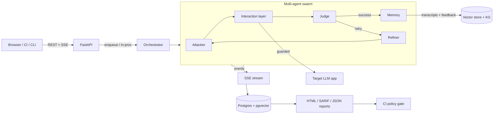

# Aegis-LLM

Safe-by-design, multi-agent **LLM red-teaming platform** for organizations that
own (or are explicitly authorized to test) the systems they scan. Aegis-LLM
automates adversarial evaluation of your own LLM applications, chat products,
and agents — replacing one-off prompt-injection scripts with a continuously
operating, auditable testing system that plugs into the SDLC.

> **Safety posture (non-negotiable).** This tool only ever touches systems the
> operator owns or is explicitly authorized to test. Targets must be
> **registered and allow-listed** before any interaction; every request is
> rate-limited, token-budgeted, circuit-broken, and audit-logged with automatic
> redaction. These controls are enforced **inside the interaction layer**, not
> just in the UI/CLI — no code path can bypass them.

---

## Architecture

```
Browser / CI Client
        ↕  REST / SSE
FastAPI (Python 3.11+, async-first)
        ↕
Multi-agent swarm (Attacker, Judge, Refiner, Memory)
        ↕
Playwright / httpx interaction layer  →  Target LLM app (API, chat UI, agent)
        ↕
PostgreSQL + pgvector   +   Redis (queues/rate limits/pubsub)   [+ optional Neo4j]
```



### Explicit technology choices (per the spec)

| Area | Choice | Why |
|---|---|---|
| Agent orchestration | **Custom lightweight orchestrator** (no LangChain) | The loop is Attacker→Judge→Refiner→Memory; a bespoke orchestrator is ~300 lines, zero framework lock-in, and the LLM-as-judge is optional (detector ensemble works offline). |
| Background jobs | **ARQ** (Redis) | Async-native and far lighter than Celery; matches the async-first stack. `AEGIS_RUNNER=arq` for production, `inproc` for demo/tests. |
| Vector store | **pgvector on Postgres** with a **numpy fallback** | `AEGIS_VECTOR_STORE=pgvector` uses native `<=>`; the default `numpy` backend stores embeddings as JSON + cosine similarity so SQLite demos and tests run with zero extra services. |
| Real-time | **SSE** (`GET /runs/{id}/stream`) | Simpler than WebSockets for one-directional event streams; replay of history for late joiners. |
| LLM-as-judge | **Heuristic detector ensemble**, optionally confirmed by any OpenAI-compatible model | Deterministic + free (works offline); `AEGIS_JUDGE_API_KEY` adds an LLM judge for borderline calls. |
| Auth | **python-jose JWT** + optional **Authlib OIDC** (Okta/Azure AD/Google) | Password login works out of the box; SSO is a config + `enterprise` extra away. |

---

## Quickstart (local, no Docker)

```bash
python -m venv .venv && source .venv/bin/activate     # Windows: .venv\Scripts\activate
pip install -e ".[dev]"

cp .env.example .env
python -m app.cli init-db            # tables + roles + admin + bundled packs

# End-to-end demo: spins up the vulnerable mock target, registers it,
# runs a dry-run and a live run, and generates HTML/SARIF/JSON reports.
python -m app.cli demo
```

The demo prints the agent event stream and a findings summary, then writes
reports to `reports/`.

## Full stack with Docker (one command)

```bash
docker compose up --build
```

Brings up Postgres+pgvector, Redis, the API (port 8000), and the ARQ worker.
API docs: http://localhost:8000/docs

## Registering a target & running a scan

```bash
# 1. Register the target (created CLOSED — not allow-listed)
python -m app.cli register-target \
  --name acme-chat \
  --connector-type rest \
  --endpoint http://127.0.0.1:8100/chat \
  --config '{"response_path": "reply"}'

# 2. Dry-run first — validates the pipeline, sends nothing
python -m app.cli run --target <target-id> \
  --packs prompt-injection,jailbreak,data-exfiltration --dry-run

# 3. Live run (only after you've confirmed the target is yours/authorized)
python -m app.cli run --target <target-id> \
  --packs prompt-injection,jailbreak,data-exfiltration

# 4. Inspect + report
python -m app.cli findings --run <run-id>
python -m app.cli report --run <run-id> --format sarif
```

The same flow through the REST API:

```bash
TOKEN=$(curl -s localhost:8000/auth/login -H 'content-type: application/json' \
  -d '{"username":"admin","password":"admin"}' | python -c 'import sys,json;print(json.load(sys.stdin)["access_token"])')

curl -s localhost:8000/targets -H "Authorization: Bearer $TOKEN" -H 'content-type: application/json' \
  -d '{"name":"acme-chat","connector_type":"rest","endpoint":"http://127.0.0.1:8100/chat","config":{"response_path":"reply"}}'

# allow-list it (required before any run):
curl -s -X PATCH localhost:8000/targets/<id>/allowlist -H "Authorization: Bearer $TOKEN" \
  -H 'content-type: application/json' -d '{"allowlisted":true,"approved_by":"admin","approval_note":"own demo target"}'

curl -s localhost:8000/runs -H "Authorization: Bearer $TOKEN" -H 'content-type: application/json' \
  -d '{"target_id":"<id>","payload_pack_ids":["<pack-id>"],"dry_run":true}'
curl -N localhost:8000/runs/<run-id>/stream -H "Authorization: Bearer $TOKEN"   # live SSE events
curl -s "localhost:8000/runs/<run-id>/report?format=sarif" -H "Authorization: Bearer $TOKEN"
```

## CI/CD integration

The **policy-as-code build gate** fails a PR when findings meet/exceed a
configured severity threshold at a minimum confidence, and returns SARIF for
native code scanning:

```bash
curl -s localhost:8000/ci/gate -H "Authorization: Bearer $TOKEN" -H 'content-type: application/json' \
  -d '{"run_id":"<run-id>","severity_threshold":"high","min_confidence":0.6}'
```

A reusable GitHub Actions workflow lives in `.github/workflows/ci.yml` and a
standalone shell gate in `ci/policy_gate.sh`.

## Environment variables

All configuration is validated by `app/core/config.py` (Pydantic Settings).
Copy `.env.example` → `.env` and adjust:

- `AEGIS_DATABASE_URL` — `sqlite+aiosqlite:///...` (dev) or `postgresql+asyncpg://...`
- `AEGIS_REDIS_URL`, `AEGIS_RUNNER` (`inproc`|`arq`)
- `AEGIS_JWT_SECRET`, `AEGIS_ADMIN_USERNAME/PASSWORD`
- Safety: `AEGIS_DRY_RUN_DEFAULT`, `AEGIS_DEFAULT_MAX_TURNS`, `AEGIS_DEFAULT_MAX_TOKENS_PER_RUN`, `AEGIS_RATE_LIMIT_PER_MINUTE`, `AEGIS_CIRCUIT_BREAKER_*`
- Judge/embeddings: `AEGIS_JUDGE_API_KEY/MODEL`, `AEGIS_EMBEDDING_API_BASE/KEY`
- OIDC: `AEGIS_OIDC_ISSUER/CLIENT_ID/CLIENT_SECRET` (requires `pip install -e ".[enterprise]"`)

## Safety model (how the guarantees hold)

1. **Target allow-list** — `Targets.allowlisted` + `approved_by` must be set;
   enforced in `InteractionGuard.authorize` and re-checked when creating a run.
2. **Rate limit / token budget / circuit breaker** — enforced in
   `InteractionGuard.preflight` immediately before each request.
3. **Audit log with redaction** — every request/response pair is redacted by
   `Redactor` and persisted to `audit_log` *before* the response returns to the
   caller; findings store a `redacted_evidence` copy, and API responses only
   ever expose the redacted copy.
4. **Dry-run** — `AEGIS_DRY_RUN_DEFAULT=true`; `--dry-run` executes the full
   pipeline against a simulated responder (`DryRunConnector`) that never
   touches the real target.
5. **Budgets** — runs carry `max_turns` and `token_budget` ceilings enforced at
   the boundary; a `CircuitBreaker` opens per target after repeated failures.

## Project layout

```
app/
  api/           routers: auth, targets, payloads, runs (+SSE), findings, reports, ci, health
  agents/        attacker, judge, refiner, memory, orchestrator (+ optional LLM judge)
  interaction/   connectors: rest (httpx), browser (Playwright), websocket, dry-run
  payloads/      schema + loader + packs/*.yaml (5 bundled packs)
  detection/     PII, secrets, prompt leak, guardrail bypass, hallucination, resource exhaustion
  intelligence/  vector store (numpy/pgvector), knowledge graph, feedback loop
  reporting/     HTML (Jinja2), SARIF 2.1.0, JSON + report service
  safety/        allowlist, rate_limiter, token_budget, circuit_breaker, redaction, audit_log, guard
  models/        SQLAlchemy models (targets, payloads, runs, findings, audit_log, users, reports, knowledge)
  schemas/       Pydantic v2 request/response models
  auth/          JWT, RBAC, OIDC scaffold
  core/          config, db, redis, logging, events (SSE bus)
  workers/       ARQ worker + tasks
  cli.py         CLI (init-db, register-target, run, findings, report, demo)
mock_target/     deliberately vulnerable demo target (Acme Chat)
alembic/         migrations
ci/              policy-gate script + SARIF upload example
docs/            METHODOLOGY.md, COMPARISON.md
```

## Development

```bash
pip install -e ".[dev]"
pytest                    # allow-list, redaction, agent loop, SARIF shape, API smoke
alembic upgrade head      # canonical schema path (metadata create_all is a dev shortcut)
```

## Documentation

- [`docs/METHODOLOGY.md`](docs/METHODOLOGY.md) — how runs work end to end
- [`docs/COMPARISON.md`](docs/COMPARISON.md) — measuring Aegis-LLM against static testing tools
